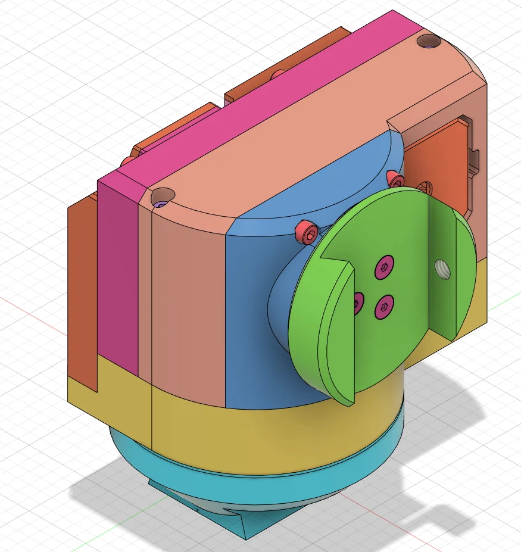

<!-- zurp-readme-header:begin — paste this block once, never again: the poster and the badges update themselves at each build of the site — do not edit it -->

<!-- zurp-readme-header:end -->

<h1 align="center">Berserker</h1>

<strong><em>Forward to the stars</em></strong>

  <a href="https://zurp-astronomics.github.io/berserker/">Website</a> ·
  <a href="../../releases">Releases</a> ·
  <a href="https://github.com/zUrp-Astronomics">zUrp Astronomics</a>

---

## 🚧 Work in progress — do not build yet 🚧

**Nothing here is validated on real hardware.** 
Files change without notice, and what you build today may need rework tomorrow. 
👀 Watch the repository to know when the first release lands.

---

## Why Berserker?

The ZWO AM3 set the standard for grab-and-go harmonic mounts: small enough to throw in a bag, strong
enough for real imaging. **Berserker brings that class of mount to your own printer — at half the
weight**, and built for the payloads that make small mounts sweat: a C5 or a C6, astrographs, long
focal lengths. No sealed box from a catalogue: a mount you can print, take apart, understand, repair
and improve.

- **AM3-class.** The same league as the compact harmonic mounts from the shop — not the toy aisle.
- **Half the weight.** Less to carry to the dark site, more night left once you are there.
- **3D printed, core included.** The mount comes off a printer, not off a production line.
- **Open all the way.** Sources, models and files. Fork it, hack it, own it.

## At a glance

| | |
|---|---|
| Type | harmonic equatorial mount |
| Class | ZWO AM3, at half the weight |
| Construction | 3D printed, core included |
| Payloads | a C5 or a C6, astrographs, long focal lengths |

## Status & roadmap

The current design is on the bench and is not in this repository yet. The files here are an **old
iteration, v2.1**, kept for the record: they have nothing in common with the current design, and
they are not a kit. The new design lands here with its first release.

## Hardware (v2.1, archive)

- `2_Hardware/` — the Fusion 360 design source, the STEP parts and the mechanical bill of materials.
- `3_3D-Models/` — the parts ready to print (3MF), and their G-code sliced for a Prusa MK3S, in PC
  and PETG.

## Repository layout

| Folder | Contents |
|---|---|
| [`2_Hardware/`](2_Hardware/) | mechanics outside the board: enclosure, parts, design sources, mechanical BoM |
| [`3_3D-Models/`](3_3D-Models/) | ready-to-print files (3MF) and their sliced G-code |
| [`9_Assets/`](9_Assets/) | the showcase: product sheet, poster and README images |

## License

- **Hardware design** — boards, mechanics and 3D models: [Open Community License v1.1](LICENSE-HARDWARE).
- **Everything else** — firmware, software, documentation and images: [GNU GPL v3.0](LICENSE).

---

<a href="https://zurp-astronomics.github.io/">zUrp Astronomics</a> — a subsidiary of zUrp Industries. Because buying is cheating.

