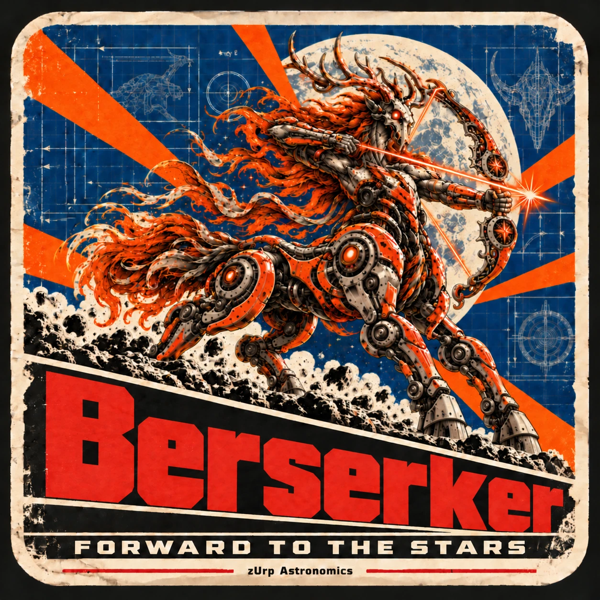

<!-- En-tête vitrine : remplacer ce commentaire par le bloc de
     https://github.com/zUrp-Astronomics/.github/blob/main/readme-kit/repos/<slug>.md
     (affiche + badge de statut, servis par le site). Collé une fois, il se met à jour seul. -->

  

# Berserker — forward to the stars

**Date** : 2026-10-06
**Status** : wip
**Referenced by** : every user of this repository

<h3 align="center">A ZWO AM3, 3D printed. Same class of mount, half the weight.</h3>

> [!WARNING]
> **Nothing has come out of the oven yet. Do not build this.**
>
> No version of Berserker has been released, and nothing here is validated. The files in this
> repository are an **old iteration (v2.1)** that has nothing in common with the current design.
> They are kept for the record. They are not a kit.

## The pitch

The ZWO AM3 is a compact harmonic mount: a strain wave drive and a belt, and it runs in both
equatorial and alt-azimuth modes. It is small enough to throw in a bag and has enough grip for real
imaging. It set the standard for what a grab-and-go mount should be.

**Berserker brings that class of mount to your own printer.** It is AM3-class, at half the weight,
and it is open hardware. You don't get a sealed box from a catalogue: you get a mount you can print,
take apart, understand, repair and improve.

- **AM3-class.** It plays in the same league as the compact harmonic mounts from the shop, not in
  the toy aisle.
- **Half the weight.** That means less to carry to the dark site and more night left once you're
  there.
- **3D printed.** The mount comes off a printer, not off a production line.
- **Open, all the way.** The sources, models and files are all open. Fork it, hack it, own it.

## Where it stands

Berserker is in active development. The current design is on the bench, and you won't find it in
this repository yet. When a version comes out of the oven, it will be published here with its
release. Until then, watch the repository, or follow the rest of the fleet at
[zUrp Astronomics](https://github.com/zUrp-Astronomics).

## License

Open hardware, with no small print: the whole repository is licensed under the
**Open Community License v1.1 (OCL v1.1), with no add-on**. See [`LICENSE`](LICENSE).
